# Multi-Department Ticketing System - Workflow Analysis

---

## 1. Architecture Layers

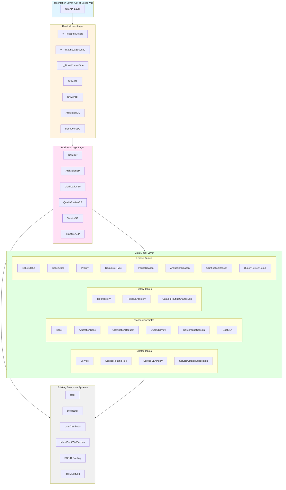

---

## 2. Spec-Level Dependencies

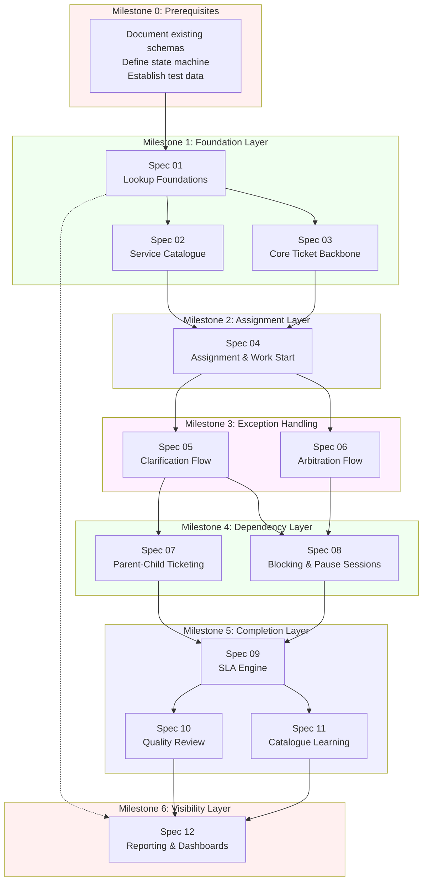

---

## 3. Table Creation Order

```mermaid
graph LR
    subgraph P1["Phase 1: Lookup Tables (Spec 01)"]
        L1[TicketStatus]
        L2[TicketClass]
        L3[Priority]
        L4[RequesterType]
        L5[PauseReason]
        L6[ArbitrationReason]
        L7[ClarificationReason]
        L8[QualityReviewResult]
    end

    subgraph P2["Phase 2: Master Tables (Spec 02)"]
        M1[Service]
        M2[ServiceRoutingRule]
        M3[ServiceSLAPolicy]
        M4[ServiceCatalogSuggestion]
    end

    subgraph P3["Phase 3: Transaction Tables"]
        T1[Ticket<br/>Spec 03]
        T5[ClarificationRequest<br/>Spec 05]
        T2[ArbitrationCase<br/>Spec 06]
        T6[QualityReview<br/>Spec 10]
        T3[TicketPauseSession<br/>Spec 08]
        T4[TicketSLA<br/>Spec 09]
        T7[CatalogRoutingChangeLog<br/>Spec 11]
    end

    subgraph P4["Phase 4: History Tables"]
        H1[TicketHistory<br/>Spec 03]
        H2[TicketSLAHistory<br/>Spec 09]
        H3[CatalogRoutingChangeLog<br/>Spec 11]
    end

    P1 --> P2
    P2 --> P3
    P3 --> P4

    style P1 fill:#e1f5ff
    style P2 fill:#fff4e1
    style P3 fill:#ffe1f5
    style P4 fill:#e1ffe1
```

---

## 4. Ticket State Machine (Inferred - Needs Definition)

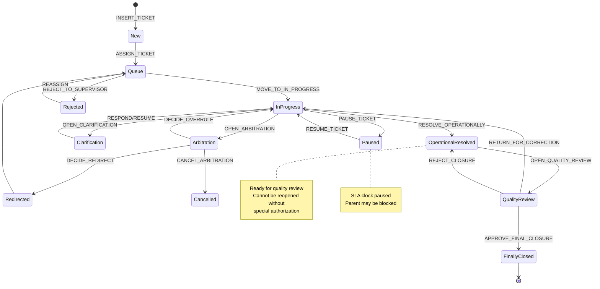

---

## 5. Stored Procedure Dependencies

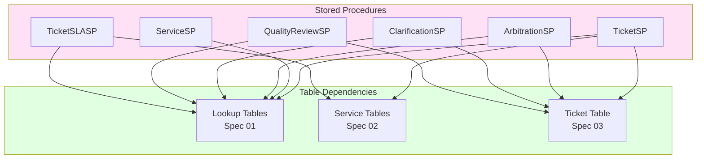

---

## 6. Milestone Execution Flow

```mermaid
graph LR
    subgraph M0["Milestone 0: Prerequisites"]
        TASK0[Document schemas<br/>Define state machine<br/>Create test data]
    end

    subgraph M1["Milestone 1: Foundation"]
        TASK1[Create lookups<br/>Build service catalogue<br/>Core ticket creation]
        CHECK1[Checkpoint:<br/>Can create ticket?]
    end

    subgraph M2["Milestone 2: Assignment"]
        TASK2[Queue handling<br/>User assignment<br/>Work start]
        CHECK2[Checkpoint:<br/>Can assign & start work?]
    end

    subgraph M3["Milestone 3: Exceptions"]
        TASK3[Clarification workflow<br/>Arbitration workflow<br/>Scope disputes]
        CHECK3[Checkpoint:<br/>Can handle exceptions?]
    end

    subgraph M4["Milestone 4: Dependencies"]
        TASK4[Parent-child tickets<br/>Blocking logic<br/>Pause sessions]
        CHECK4[Checkpoint:<br/>Can model dependencies?]
    end

    subgraph M5["Milestone 5: Completion"]
        TASK5[SLA engine<br/>Quality review<br/>Catalogue learning]
        CHECK5[Checkpoint:<br/>Full lifecycle works?]
    end

    subgraph M6["Milestone 6: Visibility"]
        TASK6[Dashboard views<br/>Reporting DL<br/>Leadership metrics]
        CHECK6[Checkpoint:<br/>Full system ready?]
    end

    TASK0 --> TASK1 --> CHECK1
    CHECK1 --> TASK2 --> CHECK2
    CHECK2 --> TASK3 --> CHECK3
    CHECK3 --> TASK4 --> CHECK4
    CHECK4 --> TASK5 --> CHECK5
    CHECK5 --> TASK6 --> CHECK6

    style TASK0 fill:#fff0f0
    style TASK1 fill:#f0fff0
    style TASK2 fill:#f0f0ff
    style TASK3 fill:#fff0ff
    style TASK4 fill:#f0fff0
    style TASK5 fill:#f0f0ff
    style TASK6 fill:#fff0f0

    style CHECK1 fill:#ffd700
    style CHECK2 fill:#ffd700
    style CHECK3 fill:#ffd700
    style CHECK4 fill:#ffd700
    style CHECK5 fill:#ffd700
    style CHECK6 fill:#ffd700
```

---

## 7. Critical Gaps Summary

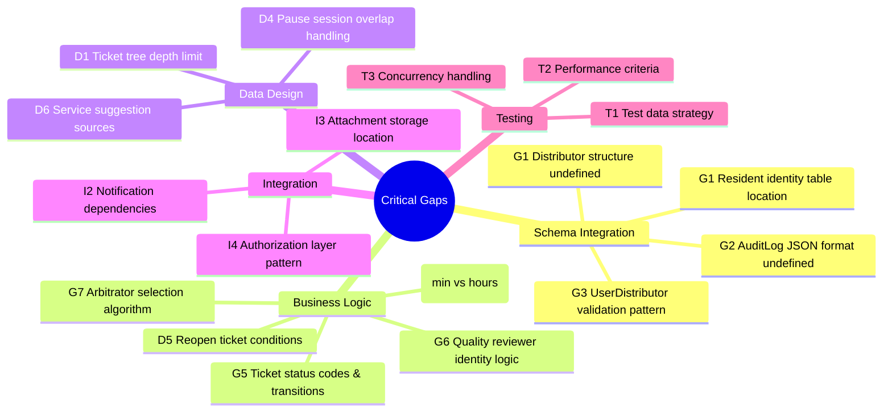

---

## 8. Priority-Based Execution Matrix

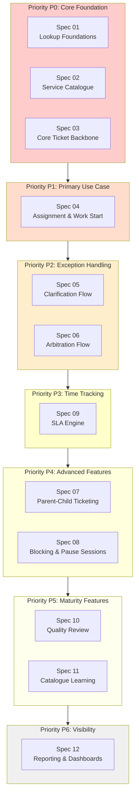

---

## 9. Data Flow: Known Service Ticket

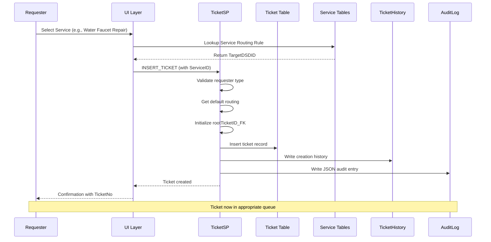

---

## 10. Data Flow: Arbitration Case

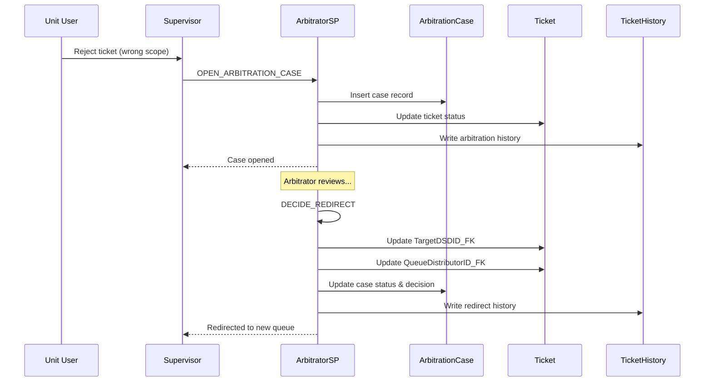

---

## 11. Parent-Child Blocking Flow

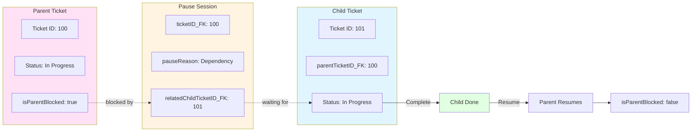

---

## 12: Quick Reference - Spec Deliverables

```mermaid
graph TB
    subgraph Legend["Legend"]
        LDB[Database Tasks]
        LSP[Stored Procedures]
        LV[Views / DL]
        LUI[UI Tasks]
    end

    subgraph Spec01["Spec 01: Lookup Foundations"]
        S01DB[8 Lookup Tables<br/>Seed Scripts]
        S01T[Uniqueness Tests]
    end

    subgraph Spec02["Spec 02: Service Catalogue"]
        S02DB[4 Master Tables]
        S02SP[ServiceSP - 8 Actions]
        S02R[V_ServiceFullDefinition<br/>ServiceDL]
        S02UI[5 Admin Screens]
    end

    subgraph Spec03["Spec 03: Core Ticket"]
        S03DB[Ticket + TicketHistory]
        S03SP[TicketSP - INSERT_TICKET]
        S03R[V_TicketFullDetails<br/>V_TicketLastAction<br/>TicketDL]
        S03UI[Creation + Details + List]
    end

    subgraph Spec04["Spec 04: Assignment"]
        S04SP[TicketSP - 4 Actions]
        S04R[Inbox Extensions]
        S04UI[4 Assignment Screens]
    end

    subgraph Spec05["Spec 05: Clarification"]
        S05DB[ClarificationRequest]
        S05SP[ClarificationSP - 3 Actions]
        S05UI[2 Clarification Screens]
    end

    subgraph Spec06["Spec 06: Arbitration"]
        S06DB[ArbitrationCase]
        S06SP[ArbitrationSP - 4 Actions]
        S06R[ArbitrationDL]
        S06UI[2 Arbitration Screens]
    end

    subgraph Spec07["Spec 07: Parent-Child"]
        S07SP[TicketSP - CREATE_CHILD]
        S07R[Tree Loading Extension]
        S07UI[2 Parent-Child Screens]
    end

    subgraph Spec08["Spec 08: Blocking"]
        S08DB[TicketPauseSession]
        S08SP[TicketSP - 2 Actions]
        S08UI[3 Pause/Resume Screens]
    end

    subgraph Spec09["Spec 09: SLA"]
        S09DB[TicketSLA + History]
        S09SP[TicketSLASP]
        S09R[V_TicketCurrentSLA]
        S09UI[SLA Badges + Lists]
    end

    subgraph Spec10["Spec 10: Quality"]
        S10DB[QualityReview]
        S10SP[QualityReviewSP - 4 Actions]
        S10UI[3 Quality Screens]
    end

    subgraph Spec11["Spec 11: Learning"]
        S11DB[CatalogRoutingChangeLog]
        S11SP[ServiceSP - 2 Actions]
        S11UI[3 Learning Screens]
    end

    subgraph Spec12["Spec 12: Reporting"]
        S12R[3 Inbox Views<br/>DashboardDL]
        S12UI[4 Dashboard Screens]
    end

    style LDB fill:#e1ffe1
    style LSP fill:#ffe1f5
    style LV fill:#fff4e1
    style LUI fill:#e1f5ff
```

---

*Generated from plan.md analysis*
*Last Updated: 2026-03-30*
